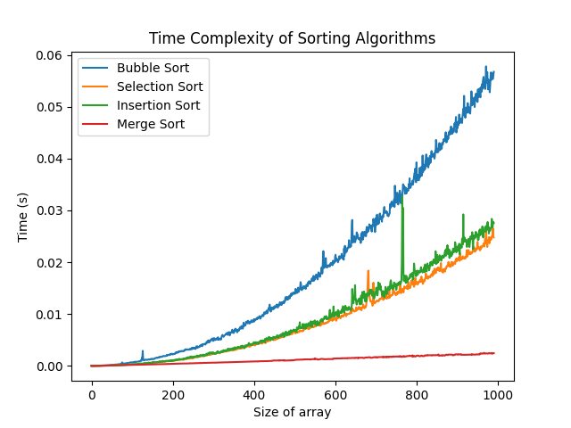

# A Visualization of Sorting Algorithms

## Overview

This project is a visualization of sorting algorithms. The sorting algorithms that are currently implemented are:

- Bubble Sort
- Selection Sort
- Insertion Sort
- Merge Sort

This project is written in python and uses the matplotlib library for data visualization.

The project currently supports testing the following benchmarks:

- Time Complexity
- Number of Swaps
- (In Progress) Number of Comparisons

## Results

Time Complexity of Sorting Algorithms over a range of input sizes:

## Reasons for this project

This project is a visualizer for sorting algorithms. This project was created to show the applications of sorting algorithms and to help understand the real world use of big O(n) notation. This project was also created increase proficiency in python specifically in the use of the matplotlib data visualization library.